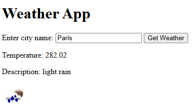
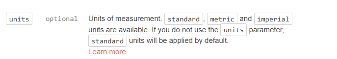
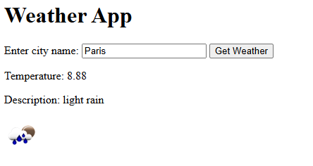
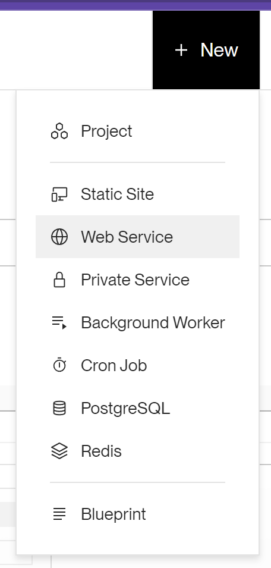
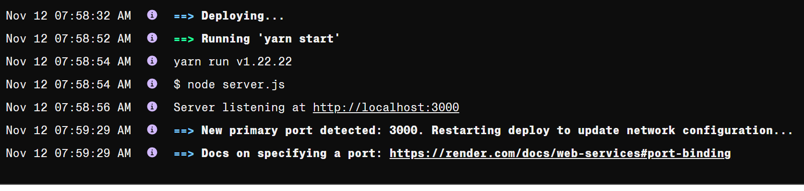

1. Start by creating two folders in your project directory: backend and frontend. The backend folder will contain the server-side code, and the frontend folder will contain the client-side code.
1. In the backend folder, create a new file called `server.js` and add the following code:
   ```javascript
   const express = require("express");
   const app = express();
   ```
   The code above imports the Express.js library and creates an instance of the Express application.
1. Change the terminal working directory to the backend folder, execute the command `npm init -y` to create a `package.json` file. This file will contain information about the project and its dependencies.
   ```bash
   npm init -y
   ```
    <details>
    <summary>
    `cd` command
    </summary>
      The `cd` command is used to change the current working directory in the terminal. For example, to change to the backend folder, you can use the following command:
      ```bash
      cd backend
      ```
    </details>
1. Next, add the following code to create a route that listens for GET requests on the `/weather` endpoint:

   ```javascript
   app.get("/weather", (req, res) => {
     const city = req.query.city;
     // TODO - Make a request to the openweathermap.org API
     // TODO - Return the weather data
   });
   ```

   This code defines a route that takes a query parameter `city` and makes a request to the `openweathermap.org` API to get the weather data for the specified city.
   <details>
   <summary>
   `app.get()`
   </summary>
   Remember, `app.get()` is a method in Express that creates a route for handling GET requests. `/weather` is the endpoint that the route listens for, and the callback function `(req, res)` is executed when a request is made to that endpoint.The `req` object represents the HTTP request, and the `res` object represents the HTTP response. The `req.query` object contains the query parameters in the URL. In this case, we are extracting the `city` parameter from the query string. 
   </details>

   <details>
    <summary>
    Query Parameters vs Route Parameters
    </summary>
    Query parameters are used to send data to the server as key-value pairs in the URL. For example, in the URL `http://localhost.com/weather?city=London`, the query parameter `city` has the value `London`. Query parameters are typically used for filtering, sorting, or searching data. Route parameters, on the other hand, are used to extract data from the URL path itself. For example, in the URL `http://localhost.com/weather/London`, the route parameter `London` is extracted from the URL path. Route parameters are used to define dynamic routes that can handle different values. In this tutorial, we are using query parameters to pass the city name to the server. To read query parameters in Express, we use `req.query.<parameter_name>`. On the other hand, to read route parameters, we use `req.params.<parameter_name>`.
    </details>

1. Let us test the server by adding the following code to start the server on port 3000:

   ```javascript
   const PORT = 3000;
   app.listen(PORT, () => {
     console.log(`Server running on port ${PORT}`);
   });
   ```

   This code starts the server on port 3000 and logs a message to the console when the server is running.
   Also, create `index.html` in the frontend folder and add the following code:

   ```html
   <!DOCTYPE html>
   <html lang="en">
     <head>
       <meta charset="UTF-8" />
       <meta http-equiv="X-UA-Compatible" content="IE=edge" />
       <meta name="viewport" content="width=device-width, initial-scale=1.0" />
       <title>Weather App</title>
     </head>
     <body>
       <h1>Weather App</h1>
       <form>
         <label for="city">Enter city name:</label>
         <input type="text" id="city" name="city" />
         <button type="submit">Get Weather</button>
       </form>
       <div id="weatherDiv"></div>
       <script src="app.js"></script>
     </body>
   </html>
   ```

   This code creates a simple HTML form that allows the user to enter a city name and a div element to display the weather data. It also includes a script tag to link the JavaScript file `app.js`.

1. Create a new file called `app.js` in the frontend folder and add the following code:

   ```javascript
   const form = document.querySelector("form");
   const weatherDiv = document.getElementById("weatherDiv");

   form.addEventListener("submit", async (event) => {
     event.preventDefault();
     const city = form.elements.city.value;
     const response = await fetch(`http://localhost:3000/weather?city=${city}`);
     const data = await response.json();
     weatherDiv.innerHTML = `
        ${data.msg}
      `;
   });
   ```

   This code selects the form element and the weather div from the HTML document. It adds an event listener to the form that listens for the submit event. When the form is submitted, it prevents the default form submission behavior, gets the city name from the form input, makes a request to the backend server using the fetch API, and displays the weather data in the weather div.

   <details>
   <summary>
   `async/await` Keywords
   </summary>
    The `async` and `await` keywords are used to work with asynchronous code in JavaScript. The `async` keyword is used to define an asynchronous function, which returns a Promise. The `await` keyword is used to pause the execution of an asynchronous function until a Promise is resolved. In this example, we are using `async/await` to make an asynchronous request to the backend server and wait for the response before displaying the weather data on the page. This makes the code easier to read and understand compared to using callbacks.
   </details>

1. Now let us get back to the server code and add `res.json()` to the `/weather` route to test the server:

   ```javascript
   app.get("/weather", (req, res) => {
     const city = req.query.city;
     // Make a request to the openweathermap.org API
     // Return the weather data
     res.json({ msg: `Hello World. ${city} weather data will be returned.` });
   });
   ```

   This code sends the response "Hello World" when a request is made to the `/weather` endpoint. Remember, you always need to send a response to the client when handling a request in Express. Otherwise, the client will hang and eventually time out.

   1.execute the following command to install the required dependencies:

   ```bash
   npm install express
   ```

   This command installs the Express.js library, which is required to run the server. Make sure you are in the backend folder when running this command.

1. Now is good time to add the `.gitignore` file to the project. Create a new file called `.gitignore` in the project root directory and add the following lines:

   ```bash
   node_modules
   ```

1. To start the server, you may use the node command in the terminal. Even better, you can use the `nodemon` package to automatically restart the server when changes are made to the code. To install `nodemon`, run the following command:

   you can install it globally by running:

   ```bash
    npm install -g nodemon
   ```

   To start the server using `nodemon`, run the following command:

   ```bash
    nodemon server.js
   ```

1. One last step before testing the server is to enable cross-origin resource sharing (CORS) in the server code. Add the following code to the server file:

   ```javascript
   app.use((req, res, next) => {
     res.setHeader("Access-Control-Allow-Origin", "*");
     next();
   });
   ```

   This code sets the `Access-Control-Allow-Origin` header to `*`, allowing requests from any origin. This is necessary to allow the frontend to make requests to the backend server. By default, browsers restrict cross-origin requests for security reasons, so you need to explicitly allow them using CORS headers. Read more about [Access-Control-Allow-Origin](https://developer.mozilla.org/en-US/docs/Web/HTTP/Headers/Access-Control-Allow-Origin) and [CORS](https://developer.mozilla.org/en-US/docs/Web/HTTP/CORS).

<details>
<summary>
SSR vs. API server
</summary>
Server-side rendering (SSR) and API servers are two common approaches to building web applications. In SSR, the server generates the HTML content for each page and sends it to the client. This approach is useful for improving performance and SEO, as the content is pre-rendered on the server. Remember using express to render HTML content on the server and send it to the client? This is an example of SSR. In contrast, an API server provides data to the client in JSON format, which the client then uses to render the content. This approach is useful for building single-page applications (SPAs) and decoupling the frontend and backend. This approach allows for more flexibility and scalability in the application architecture.

If API server is used, the frontend and backend are separate applications that communicate over HTTP. CORS enable the frontend to make requests to the backend server from a different origin. This is necessary when the frontend and backend are deployed on different domains or servers. In this tutorial, we are using an API server approach, where the frontend and backend are separate application. Hence, we are enabling CORS to allow the frontend to make requests to the backend server.
</details>

1. Now, open the `index.html` file in a web browser and enter a city name in the form. When you submit the form, you should see the message "Hello World" displayed on the page.
   

1. All good so far, let's now make a request to the `openweathermap.org` API to get the weather data for the specified city. To do this, you need to sign up for a free API key on the `openweathermap.org` website. Once you have the API key, you can use it to make requests to the API and get the weather data.
   In your server code, update `app.get("/weather", (req, res) => {})` to make a request to the `openweathermap.org` API and return the weather data. Here's an example of how you can do this using the `axios` library:

   ```javascript
   const axios = require("axios");
   app.get("/weather", (req, res) => {
     const city = req.query.city;
     const url = `https://api.openweathermap.org/data/2.5/weather?q=${city}&appid=YOUR_API_KEY`;
     axios
       .get(url)
       .then((response) => {
         const weatherData = {
           temperature: response.data.main.temp,
           description: response.data.weather[0].description,
           icon: response.data.weather[0].icon,
         };
         res.json(weatherData);
       })
       .catch((error) => {
         res.status(500).json({ error: "An error occurred" });
       });
   });
   ```

   Again, don't forget to install the `axios` library by running the following command in the terminal:

   ```bash
   npm install axios
   ```

   I promise you, this is the last time you will be installing a package in this tutorial 😅.

    <details>
    <summary>
    `axios` library
    </summary>
    `axios` is a popular JavaScript library for making HTTP requests. It provides a simple and easy-to-use API for sending and receiving data over the network. In this example, we are using `axios` to make a GET request to the `openweathermap.org` API to get the weather data for the specified city. The `axios.get()` method returns a Promise that resolves with the response data. We are extracting the temperature, description, and icon from the response data and sending it back to the client as JSON using `res.json()`. If an error occurs during the request, we are sending a 500 status code and an error message back to the client.
    </details>

   and update the frontend code to display the weather data returned by the server:

   ```diff
   form.addEventListener("submit", async (event) => {
     event.preventDefault();
     const city = form.elements.city.value;
     const response = await fetch(`http://localhost:3000/weather?city=${city}`);
     const data = await response.json();
   +  weatherDiv.innerHTML = `
   +    <p>Temperature: ${data.temperature}</p>
   +    <p>Description: ${data.description}</p>
   +    
   +  `;
   });
   ```

   

1. Is it strange that the temperature is in Kelvin? If you read the _openweathermap_ API documentation, you will find out that you can change the temperature units by adding the `units` parameter to the API request. The possible values for the `units` parameter are `metric`, `imperial`, and `standard`. The default value is `standard`, which returns the temperature in Kelvin. To get the temperature in Celsius, you can add the `units=metric` parameter to the API request. Update the server code to include the `units` parameter in the API request:

   ```javascript
   const url = `https://api.openweathermap.org/data/2.5/weather?q=${city}&units=metric&appid=YOUR_API_KEY`;
   ```

   This code adds the `units=metric` parameter to the API request, which returns the temperature in Celsius. You can also use `units=imperial` to get the temperature in Fahrenheit.
   
   

1. Let us now deploy the frontend and backend applications. We will deploy the frontend on Netlify and the backend on Render. Start by deploying the backend to [Render.com](https://render.com/). Sign in using your GitHub Account. Next, create new `Web Service` and select the GitHub repository where your backend code is located. Create a copy of your backend folder and initialize a new Git repository in it. Push the code to GitHub and connect the repository to Render. Render will automatically detect the Node.js application and deploy it. Once the deployment is complete, you will get a URL for the backend server. Copy this URL as we will need it to make requests from the frontend. Finally, deploy the frontend to Netlify.
   
   If for some reason the deployment fails, you can check the logs to see what went wrong. Render provides detailed logs that can help you identify and fix any issues with the deployment.
   

That is it! You have successfully created a simple weather app using Express.js and the _openweathermap_ API. Hopefully, from now on, you can set up your servers using Express.js and implement routes to handle requests. Although we have used `axios` for send HTTP requests to the _openweathermap_ API, you can also use the fetch AI to make requests.

**Challenge**: Try to enhance the app by adding more features, such as displaying additional weather data and improving the user interface.

I hope you enjoyed this tutorial and learned something new. Happy coding! 🚀
